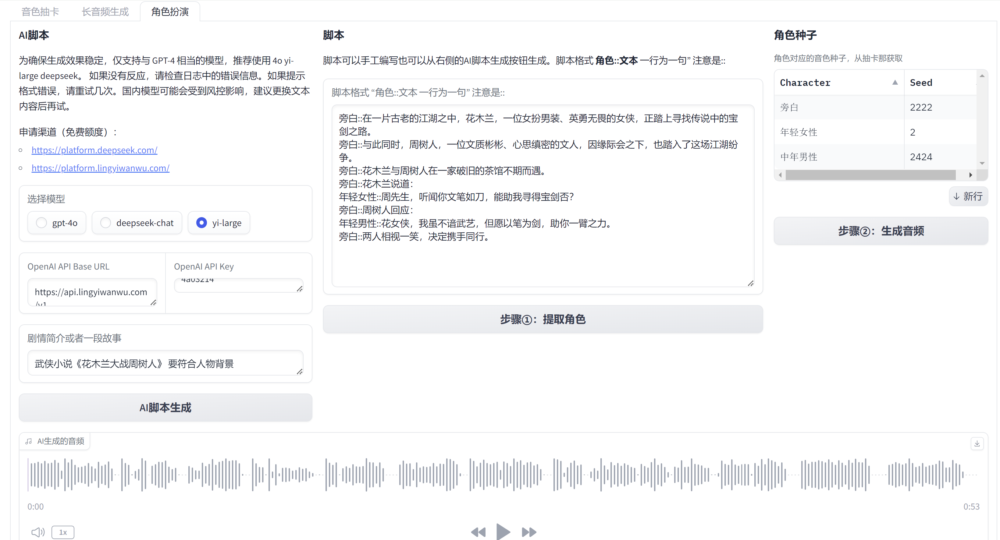
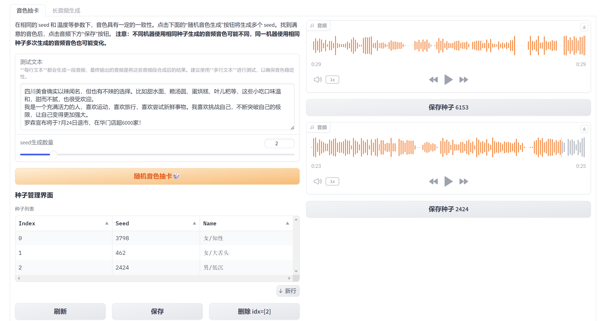
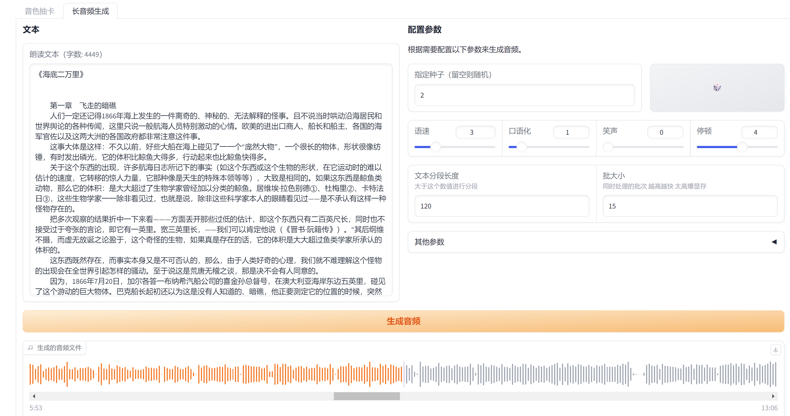

# ChatTTS_colab

基于 [ChatTTS](https://github.com/2noise/ChatTTS) 的 Colab 项目，可以在 Google Colab 上一键运行

### 🚀整合包下载🚀

**系统版本**: Windows 10 及以上

**下载地址**: [百度网盘](https://pan.baidu.com/s/199imviwIB3ak_SFZRrQKjQ?pwd=ut3a) 

**提取码**: ut3a

## 特点

- **Colab 一键运行**：无需复杂的环境配置，只需点击上方的 Colab 按钮，即可在浏览器中直接运行项目。
- **音色抽卡功能**：批量生成多个音色，并可保存自己喜欢的音色。
- **支持生成长音频**：适合生成较长的语音内容。
- **字符处理**：对数字和朗读错误的标点做了初步处理。
- **分角色朗读功能** ：🚀支持对不同角色的文本进行分角色朗读，并支持大模型一键生产脚本。

## 功能展示

### 分角色朗读功能

### 音色抽卡功能

### 支持生成长音频

## 快速开始

1. 点击最上方的 "Open In Colab" 按钮，打开 Colab 笔记本。
2. 点击菜单栏的–代码执行程序–全部运行即可
3. 执行后在下方的日志中找到类似
   Running on public URL: https://**********.gradio.live
4. https://**********.gradio.live 就是可以访问的公网地址

## 贡献

欢迎对本项目提出建议或贡献代码。请通过 GitHub Issues 提出问题，或提交 Pull Request。

## 许可证

本项目使用 MIT 许可证。

