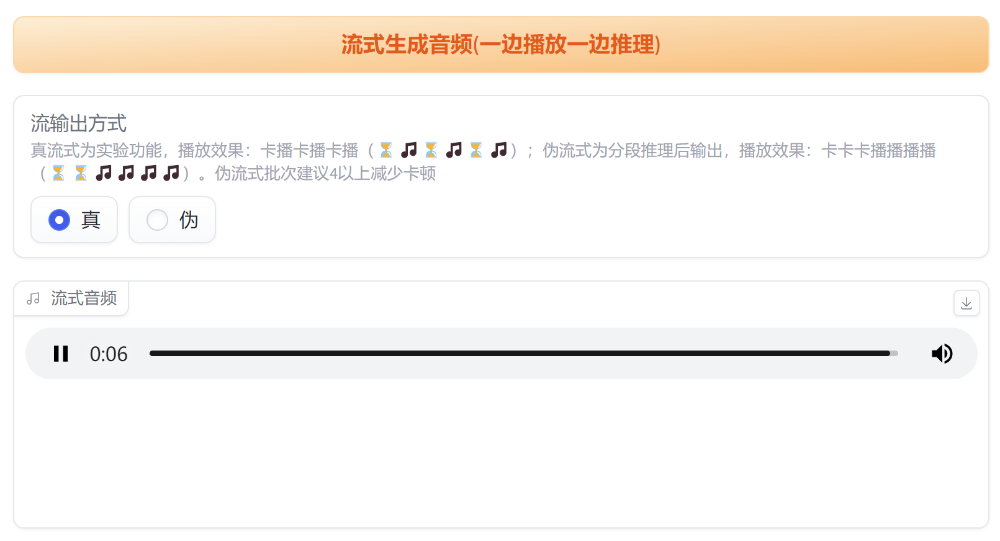

<div align="center">

# ChatTTS_colab

🚀 一键部署 简单易用 无需复杂安装（含win离线整合包）

基于 [**ChatTTS**](https://github.com/2noise/ChatTTS) ，支持流式输出、音色抽卡、长音频生成和分角色朗读。

[](https://colab.research.google.com/github/6drf21e/ChatTTS_colab/blob/main/chattts_webui_mix.ipynb)


**🏆稳定说话人音色库/区分男女已开源**  项目地址： [ChatTTS_Speaker](https://github.com/6drf21e/ChatTTS_Speaker)

[](https://modelscope.cn/studios/ttwwwaa/ChatTTS_Speaker)
[](https://huggingface.co/spaces/taa/ChatTTS_Speaker)

支持按男女、年龄、特征查找稳定音色。

</div>

## 整合版下载地址

| 版本       | 地址                                                                                                                                                                             |
|----------|--------------------------------------------------------------------------------------------------------------------------------------------------------------------------------|
| 百度网盘    | [百度网盘](https://pan.baidu.com/s/1-hGiPLs6ORM8sZv0xTdxFA?pwd=h3c5) 提取码: h3c5                                                                                                     | 
| 夸克网盘    | [夸克网盘](https://pan.quark.cn/s/c963e147f204)                                                                                                                                    | 
| 123盘    | [123盘](https://www.123pan.com/s/Fto1jv-CjUI.html)                                                                                                                              |

## 演示视频

[](https://www.youtube.com/watch?v=199fyU7NfUQ)

欢迎关注 [氪学家频道](https://www.youtube.com/@kexue) ，获取更多有趣的科技视频。

## 特点

- **Colab 一键运行**：无需复杂的环境配置，只需点击上方的 Colab 按钮，即可在浏览器中直接运行项目。
- **音色抽卡功能**：批量生成多个音色，并可保存自己喜欢的音色。
- **支持生成长音频**：适合生成较长的语音内容。
- **字符处理**：对数字和朗读错误的标点做了初步处理。
- **分角色朗读功能** ：支持对不同角色的文本进行分角色朗读，并支持大模型一键生产脚本。
- **支持流输出**：边生成边播放，无需等待全部生成完毕。

## 功能展示

### 支持流输出



### 分角色朗读功能


### 音色抽卡功能


### 支持生成长音频


## 快速开始

### 在 Colab 运行

1. 点击最上方的 "Open In Colab" 按钮，打开 Colab 笔记本。
2. 点击菜单栏的–代码执行程序–全部运行即可
3. 执行后在下方的日志中找到类似
   Running on public URL: https://**********.gradio.live
4. https://**********.gradio.live 就是可以访问的公网地址

### 在 macOS 上运行

1. 安装 [Conda](https://docs.conda.io/projects/conda/en/latest/user-guide/install/macos.html)（如果尚未安装）。
2. 打开终端，创建一个新的 conda 环境：
   ```bash
   conda create -n "ChatTTS_colab" python=3.11
   ```
3. 激活刚创建的环境：
   ```bash
   conda activate ChatTTS_colab
   ```
3. 克隆本项目仓库到本地：
   ```bash
   git clone git@github.com:6drf21e/ChatTTS_colab.git
   ```
4. 手动安装 ChatTTS 依赖到项目目录：
   ```bash
   cd ChatTTS_colab
   git clone https://github.com/2noise/ChatTTS
   cd ChatTTS
   git checkout -q f4c8329
   cd ..
   mv ChatTTS temp
   mv temp/ChatTTS ./ChatTTS
   rm -rf temp
   ```
5. 在项目目录安装 ChatTTS_colab 所需的依赖：
   ```bash
   pip install -r requirements-macos.txt
   ```
6. 运行项目，等待自动下载模型：
   ```bash
   python webui_mix.py
   # Loading ChatTTS model...
   ```
   一切正常的话会自动打开浏览器。

## 常见问题：

1. 第一次运行项目，ChatTTS 会自动从 huggingface 下载模型，如果因为网络问题下载失败，那么 ChatTTS 是无法自行重新下载的，需要清除缓存后重新触发下载。
   错误信息示例：
   ```log
   FileNotFoundError: [Errno 2] No such file or directory: '~/.cache/huggingface/hub/models--2Noise--ChatTTS/snapshots/d7474137acb4f988874e5d57ad88d81bcb7e10b6/asset/Vocos.pt'
   ```
   清除缓存的方法：
   ```bash
   rm -rf ~/.cache/huggingface/hub/models--2Noise--ChatTTS
   ```
   清除缓存后，再次执行 `python webui_mix.py`，就会重新下载模型。

   如果多次下载都无法成功，可以手动将**离线包**里的 models 拷贝到项目目录，从本地加载模型
   ```bash
      python webui_mix.py --source local --local_path models
   ```
2. 如果下载模型速度慢，建议使用赛博活菩萨 [@padeoe](https://github.com/padeoe) 的镜像加速 https://hf-mirror.com/
   ```bash
    export HF_ENDPOINT=https://hf-mirror.com
   ```

## 贡献者列表

[](https://github.com/6drf21e/ChatTTS_colab/graphs/contributors)

## 许可证

本项目使用 MIT 许可证。

